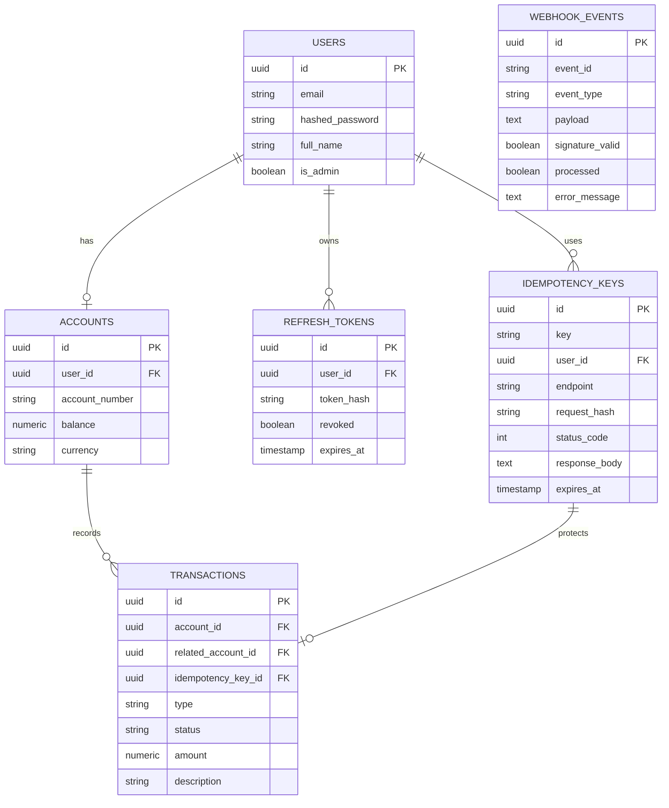

# Banking Payments API

A backend API simulating core banking operations — account balances, deposits, and payments between users — built as a learning project to apply reliability patterns that matter in real payment systems: idempotency, signed webhooks, and safe concurrent balance updates.

The main thing I wanted to practice here was making money movement *safe* under unreliable network conditions — duplicate requests, retries, and asynchronous confirmation from an external system — rather than another CRUD app with roles and approval flows.

## Tech Stack

- **Python** / **FastAPI**
- **PostgreSQL** with **SQLAlchemy 2.0**
- **Alembic** for migrations
- **Pydantic v2** for validation
- **PyJWT** + **Passlib (bcrypt)** for authentication
- **slowapi** for rate limiting
- **APScheduler** for scheduled cleanup jobs
- **pytest** + **pytest-asyncio** + **httpx** for testing

## Features

- JWT authentication with access + refresh tokens (rotation on refresh, revocation on logout), refresh tokens stored as SHA-256 hashes, never in plaintext
- OAuth2 password flow (`OAuth2PasswordBearer`) — compatible with Swagger UI's built-in "Authorize" button
- Simple admin access via an `is_admin` flag, set manually at the database level — no self-promotion endpoint exists, by design
- **Idempotency-Key** support on `POST /transactions/payments` — retrying an identical request returns the original response without re-processing; reusing the same key with a different payload is rejected with `409 Conflict`
- Row-level locking (`SELECT ... FOR UPDATE`) on every balance-changing operation — concurrent deposits/payments on the same account are handled safely
- Two-phase payment flow: funds are reserved from the sender immediately (`pending`), then either released to the recipient or refunded once an external confirmation arrives
- Inbound webhook endpoint (`/webhooks/payment-confirmation`) simulating a payment gateway callback — HMAC-SHA256 signature verification, idempotent event handling (duplicate `event_id`s are ignored), heavy processing offloaded to `BackgroundTasks` so the endpoint acknowledges quickly
- Failed webhook processing (unknown transaction, amount mismatch) is recorded with an `error_message` for later investigation, rather than failing silently
- Scheduled cleanup job (APScheduler, hourly) — purges expired idempotency keys, retires old processed webhook events, and auto-expires (with refund) payments stuck in `pending` beyond a timeout
- Admin endpoints for browsing recent accounts and transactions system-wide
- Rate limiting on login and registration endpoints

## Entity-Relationship Diagram



## Access

| Level | Can do |
|---|---|
| Authenticated user | View own account, deposit funds, make payments, view own transaction history |
| Admin (`is_admin`, set manually in DB) | View any account, view all transactions system-wide, view transactions for a specific account |

## API Endpoints

| Method | Endpoint | Access |
|---|---|---|
| POST | `/auth/register` | Public |
| POST | `/auth/login` | Public |
| POST | `/auth/refresh` | Public |
| POST | `/auth/logout` | Authenticated |
| GET | `/accounts/me` | Authenticated |
| POST | `/transactions/deposits` | Authenticated |
| POST | `/transactions/payments` | Authenticated (`Idempotency-Key` header required) |
| GET | `/transactions` | Authenticated |
| POST | `/webhooks/payment-confirmation` | External (HMAC-signed) |
| GET | `/admin/accounts` | Admin |
| GET | `/admin/transactions` | Admin |
| GET | `/admin/accounts/{account_id}/transactions` | Admin |

Full docs at `/docs` once running.

## Testing webhooks locally

Since this project has no real payment gateway integration, inbound webhook calls are simulated using Postman: a pre-request script computes the HMAC-SHA256 signature over the raw JSON body using the shared `WEBHOOK_SECRET`, replicating exactly what a real payment provider would send.

## Testing

```bash
# create a separate test database first (see .env.example for TEST_DATABASE_URL)
pytest -v
```

Covers registration/login validation, deposit validation, payment idempotency (retry safety and conflict detection), insufficient-balance handling, and webhook processing (signature verification, duplicate event handling, success/failure flows, and error tracking for invalid events).

## Known Limitations

- **No real payment gateway integration:** the API only implements the *inbound* confirmation side of a payment flow (receiving and verifying a webhook). Initiating a payment with an actual external processor, and registering a public callback URL with them, is out of scope for this project.
- **No replay protection on webhooks:** signature verification confirms authenticity and integrity, but doesn't include a timestamp, so a captured valid webhook could theoretically be replayed. Production systems (e.g. Stripe) include a timestamp in the signed payload and reject requests outside a short time window.
- **Single-instance scheduler:** the cleanup job runs via an in-process APScheduler instance. Running multiple copies of the API would run the job redundantly on each instance.
- **Offset-based pagination:** admin listing endpoints use `limit`/`offset`, which degrades on very large tables. A future iteration would move to cursor-based pagination.

## Getting Started

```bash
git clone https://github.com/MaximIoan0411/banking-payments-api.git
cd banking-payments-api
python -m venv venv
source venv/bin/activate  # venv\Scripts\Activate.ps1 on Windows
pip install -r requirements.txt
cp .env.example .env  # fill in your values
alembic upgrade head
uvicorn app.main:app --reload
```

## License

MIT